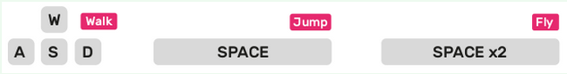

## Влез в Minecraft света

\--- task \---

Стартирайте Minecraft Pi от главното меню. Започнете игра и създайте нов свят.

\--- /task \---

\--- task \---

Движете се използвайки клавишите **W S A D**. Използвайте клавиша **space**(интервал) веднъж, за да скочите и два пъти, за да полетите.

\--- /task \---

\--- task \---

Натиснете клавиша **Tab**, за да освободите курсора на мишката и стартирайте **Mu** от главното меню.

\--- /task \---

\--- task \---

Поставете прозорците на Minecraft и Mu, така че да са един до друг.

\--- /task \---