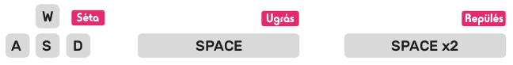

## Lépj be a Minecraft világába

\--- task \---

Nyisd meg a Minecraft Pi alkalmazást a főmenüből. Indítsd el a játékot és hozz létre egy új világot.

\--- /task \---

\--- task \---

Sétálj a **W S A D** billentyűk segítségével. Használd a **space** billentyűt az ugráshoz, kétszer a repüléshez.

\--- /task \---

\--- task \---

Nyomd meg a **Tabot** a billentyűzeten a kurzor kioldásához és nyisd meg a **Mu**-t a főmenüből.

\--- /task \---

\--- task \---

Mozgasd az ablakokat úgy, hogy a Minecraft és a Mu egymás mellett legyenek.

\--- /task \---