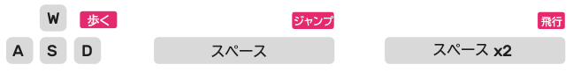

## Minecraftのワールドに入る

--- task ---

メインメニューからMinecraft Piを開きます。 ゲームを開始して新しいワールドを作りましょう。

--- /task ---

--- task ---

キーボードの**W S A D**キーを使って歩きまわりましょう。 **スペース**キーを使ってジャンプし、スペースキーを続けて2回押すと飛行します。

--- /task ---

--- task ---

キーボードの**Tab**キーを押してマウスカーソルのフォーカスを外し、メインメニューから**Mu**を開きます。

--- /task ---

--- task ---

MinecraftとMuが並ぶようにウィンドウを移動します。

--- /task ---